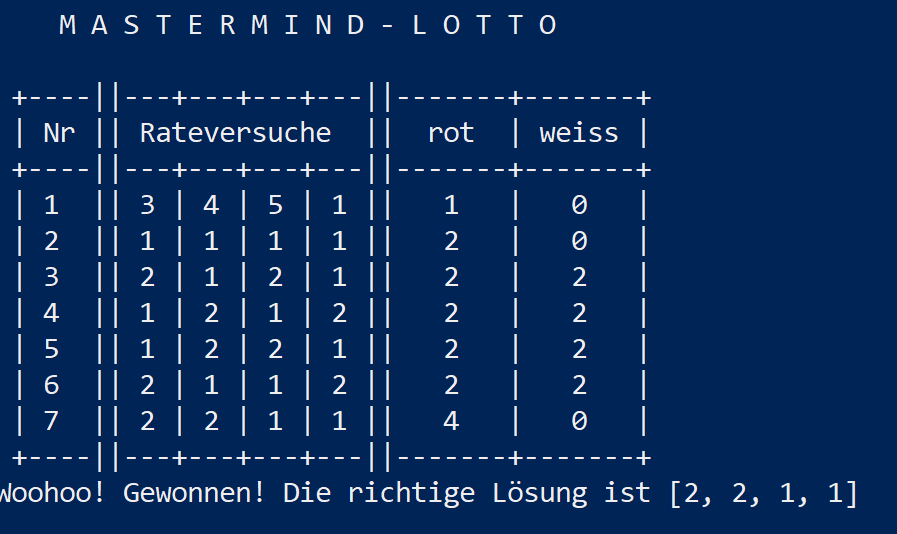

# Mastermind-Lotto (erstellt von Isabelle Veitl und Anna Weber)

Für das Spiel sind die 3 Dateien model.py, view.py, main.py nötig.
Zum Starten führe main.py aus. Zum Ausführen der main.py wird Powershell empfohlen.

Ziel des Spiels ist es, eine zufällig generierte 4-stellige Zahlenkombination aus den Zahlen 1-6 zu erraten.
  Du hast dafür 10 Rateversuche.
  Für jeden deiner 4-stelligen Rateversuche, erhälst du Feedback. 
  Wie viele Zahlen bereits an der richtigen Stelle stehen, wird dir in der Spalte 'rot' angezeigt.
  Hast du Zahlen richtig erraten, jedoch nicht an die richtige Stelle gestellt, wird dir in der Spalte 'weiss' angezeigt,
  auf wie viele Zahlen das zutrifft.

  Es werden nur Zahlen zwischen 1 und 6 akzeptiert. Alle anderen Eingaben führen zu einer Fehlermeldung und fordern dich zu einer
  korrekten Eingabe auf.
    
Die Spielanleitung und -regeln werden dir auch direkt in der Spieloberfläche angezeigt.

Beispiel-Screenshot in Gewinnsituation:

Anmerkung: Die nachträgliche Recherche hat ergeben, dass viele online verfügbare Codebeispiele geben tlw. falsches Feedback. Sie berücksichtigen nicht, wenn eine Farbe in der Lösung öfter vorkommt als im Rateversuch (bzw. umgekehrt), dass das Feedback entsprechend nicht zu oft pro Farbe gezählt werden darf.

